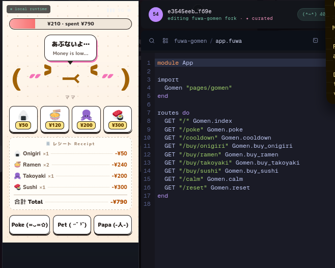
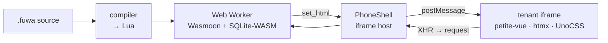

# Fuwa Runtime — Public Shell

> **Notice:** This is a refactor from the real Svelte-based app to `.fuwa`
> only. The production platform
> (SvelteKit shell, deploy/sync infra, tenant backend) is private.
> What you're looking at is the `.fuwa` application layer, rebuilt to stand on
> its own.



## What this is

A `.fuwa`-authored app runs entirely from files like `app.fuwa`,
`pages/*.fuwa`, and `models/*.fuwa`:
no Svelte components, no SvelteKit routing, no server framework.
The DSL compiles to Lua, executes in-browser via a Wasmoon Web Worker,
persists state through SQLite-WASM, and renders through a lightweight
client stack:

- **petite-vue**: reactive bindings on the rendered HTML
- **htmx**: request wiring; mutations flow back into the Lua runtime,
  not a server
- **UnoCSS**: atomic styling, generated on the fly
- **Lua**: main language

None of these are compiled into the host app. They are runtime
dependencies of the *tenant*: the sandboxed preview shell the compiled
`.fuwa` app runs inside.

## Architecture

The runtime folds a full web stack into a single browser tab across
three isolation boundaries: main thread, Web Worker
(Lua + SQLite-WASM), and a sandboxed tenant iframe. These layers only
talk over typed `postMessage` contracts.

See **[docs/architecture.md](docs/architecture.md)** for the full
breakdown, including system, execution-mode, and persistence-loop
diagrams.



## Why

The original platform proves the `.fuwa → Lua` pipeline works. This
shell proves it works *without* a hand-authored Svelte fallback
propping it up. Every interactive surface here
(state, forms, mutations, styling) is DSL-authored and DSL-driven,
right down to the reactivity layer.

## Structure

```text
app.fuwa           # root app / route declarations
pages/*.fuwa       # page definitions
models/*.fuwa      # schema-backed state (e.g. wallet, mood, ledger)
view.fuwa          # template output
hooks/*.js         # bootstrap, style, fx glue around the compiled Lua
```

## What's intentionally not here

- The SvelteKit host shell, mobile gesture layer, and editor UI
- Deploy/sync/public-preview worker infrastructure
- Any tenant billing, auth, or private content pipeline

This repo is the DSL surface only.

## Status

Experimental and actively refactored. Expect churn between example
payloads as the `.fuwa` → petite-vue/htmx/UnoCSS pattern gets settled.

## How to install

Clone the repository first:

```bash
git clone https://github.com/Schywi/fuwa.git
cd fuwa
```

Today, this public repo is still a **public shell plus documentation
surface**. It does **not** yet ship a root `package.json` or a fully
published runnable runtime from this repository root, so there is no
single `npm install && npm run dev` command to document here yet.

What you need right now depends on what you are doing:

- **Reading and extending the public docs**: Git plus a normal editor is
  enough.
- **Preparing for the public runtime/tooling drop**: install
  **Node.js 20+** and **npm 10+** now, because the documented runtime
  architecture assumes a Vite-based build step and browser-worker
  tooling around the `.fuwa` compiler/runtime.
- **Running the eventual browser runtime**: use a modern browser with
  support for **ES modules**, **Web Workers**, **WebAssembly**,
  `postMessage`, and sandboxed iframes.

As the public runtime files are published into this repo, this section
should be extended with the exact install, test, and local-run commands
rather than these architecture-level prerequisites.

## Dependencies

The public repo does not yet expose a pinned root dependency manifest,
but the current runtime architecture already implies the following
dependency stack.

### Authoring / build-time dependencies

- **Git** for source checkout
- **Node.js 20+**
- **npm 10+**
- **Vite** as the build-time bundling layer for `.fuwa` payload
  assembly and raw file loading

### Runtime engine dependencies

- **Lua** as the target language emitted by the `.fuwa` compiler
- **Wasmoon** to execute Lua inside a browser Web Worker
- **SQLite-WASM** for in-browser persistence
- **Web Workers** for isolation from the host DOM

### Tenant UI dependencies

- **petite-vue** for lightweight reactive bindings inside rendered
  tenant HTML
- **htmx** for hypermedia request wiring and fragment swaps
- **UnoCSS** for runtime atomic styling
- **GSAP** for client-side animation and effects where a payload needs
  it

### Browser/platform dependencies

- **WebAssembly**
- **ES modules**
- **sandboxed iframes**
- **`postMessage`**
- **same-tab request/response bridging between iframe and worker-owned
  runtime**

## Automation

This repo now includes GitHub Actions for:

- **CI**: Markdown linting, optional `npm test` execution when a
  `package.json` exists, and diff-format validation
- **Security**: Gitleaks secret scanning, Trivy filesystem scanning,
  dependency review on pull requests, and CodeQL analysis
