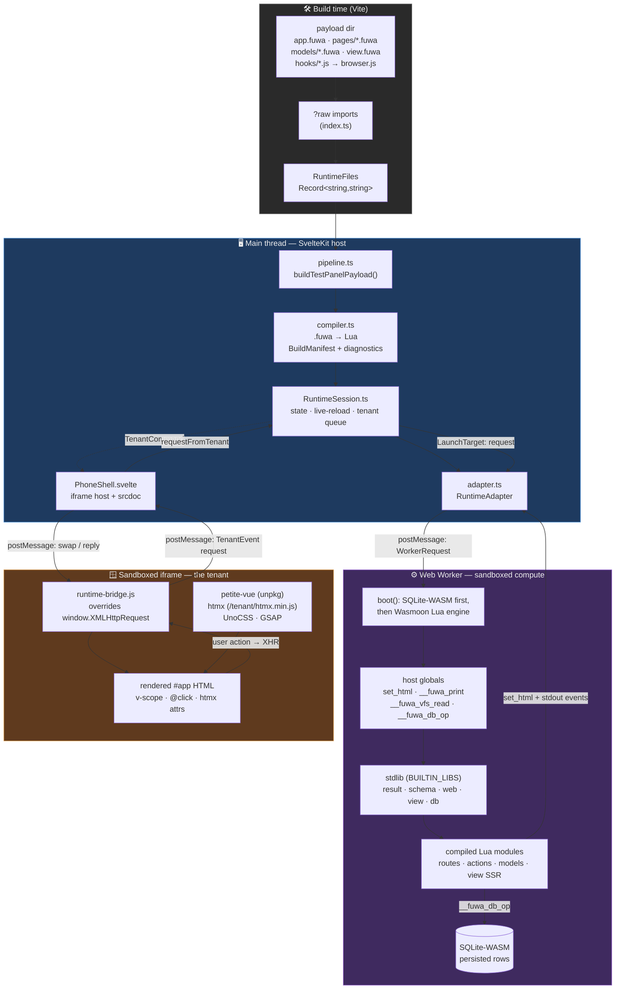
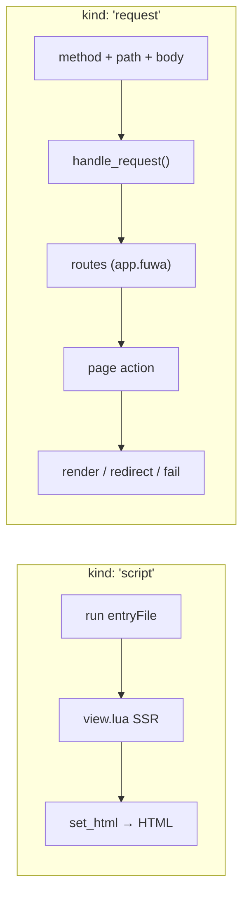
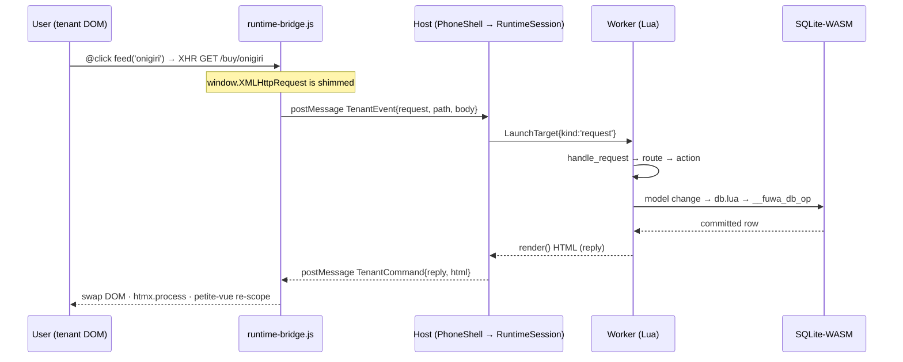

# Fuwa Runtime — Architecture

The Fuwa runtime is a **full web stack folded into a single browser tab**. There is no
server. A `.fuwa` app is compiled to Lua, executed in a Web Worker, rendered into a
sandboxed iframe, and — critically — its own HTTP requests are caught and looped back
into the in-browser Lua "server." Persistence lands in SQLite-WASM.

The whole design is organized around **three isolation boundaries** plus a build step:

| Boundary | Runs | Trusts |
|---|---|---|
| **Build time** (Vite) | `.fuwa` + hooks bundled into a string map | authoring code only |
| **Main thread** (host) | orchestration, compiler, preview shell | the app author |
| **Web Worker** | Wasmoon Lua VM + SQLite-WASM | nothing from the DOM |
| **Sandboxed iframe** (tenant) | rendered HTML + petite-vue/htmx/UnoCSS | nothing; `allow-scripts allow-forms` |

The two runtime boundaries never touch directly. Everything crosses via `postMessage`
with typed message contracts (`TenantCommand` down, `TenantEvent` up; `WorkerRequest`
in, worker events out).

---

## System diagram

---

## The two execution modes

A run is driven by a **`LaunchTarget`**, which has exactly two shapes:

- **script** — first paint. The entry runs top-to-bottom and emits HTML.
- **request** — every interaction after that. The bridge turns a same-origin XHR into a
  `request` target; `handle_request` dispatches through the routes declared in `app.fuwa`
  to a page action, which returns a `render`/`redirect`/`fail` response.

---

## The persistence loop (why XHR, not fetch)

This is the single most important flow in the system — a browser tab talking HTTP to
itself:

Mutations **must** use `XMLHttpRequest`, because the bridge only shims `XMLHttpRequest`
— a raw `fetch()` escapes the tenant and never reaches the Lua DB. (This is the bug fixed
in commit `fix(fuwa-gomen): persist via XHR so mutations hit the Lua DB`.)

---

## Where the three client libraries actually live

petite-vue, htmx, and UnoCSS are **not** bundled into the host app. They are injected
into the tenant iframe's `srcdoc` and only exist inside that sandbox:

- **petite-vue** — `v-scope` / `@click` reactive bindings, loaded from unpkg
- **htmx** — declarative request attributes, served locally at `/testpanel/tenant/htmx.min.js`
- **UnoCSS** — atomic classes generated at runtime
- **GSAP** — injected onto `window.gsap` by the bridge for effects

The host only knows how to render a string of HTML and shuttle messages. The reactive
layer belongs entirely to the DSL-authored app.

---

## File map

| Path | Role |
|---|---|
| `engine/compiler.ts` | `.fuwa` → Lua transpiler, manifest, diagnostics |
| `engine/RuntimeSession.ts` | main-thread orchestrator + state store |
| `engine/adapter.ts` · `worker.ts` | Web Worker boot + message protocol |
| `engine/sqlite.ts` | SQLite-WASM init + `__fuwa_db_op` |
| `engine/stdlib/*.lua` | `result` · `schema` · `web` · `view` · `db` runtime |
| `ui/engine/PhoneShell.svelte` | iframe host, `srcdoc`, `postMessage` plumbing |
| `ui/engine/runtime-bridge.js` | in-tenant XHR shim + DOM processing |
| `payloads/*/` | `.fuwa` sources + hooks assembled into `RuntimeFiles` |
