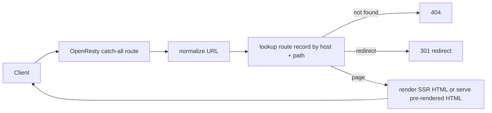

# OpenResty SSR and SEO Routing

This note documents the next step after replacing the Python dev server with
OpenResty: public routing, SSR, and dynamic URL resolution for blog-style pages,
public project pages, or a Replit/CodePen-style publish surface.

The core constraint is simple:

> Do not generate one Nginx `location` block per published page.

Nginx should be loaded once with a small number of stable routes. OpenResty then
resolves public URLs at request time inside Lua.

## The problem to solve

We want all of these at the same time:

- human-readable public URLs
- SEO-discoverable pages
- dynamic route creation without reloading Nginx
- support for many published pages/projects
- a clean separation between public page routing and runtime execution

The wrong model is:

- generate a random slug
- write a new `location /some-slug` block
- reload Nginx after every deploy

The correct model is:

- keep one catch-all route
- resolve host + path in Lua
- use readable public slugs
- keep opaque IDs internal

## URL model

Public URLs should be readable. The random deployment token, if one exists,
should stay internal.

Recommended public shapes:

- `/blog/openresty-ssr-explained`
- `/@alice/openresty-ssr-explained`
- `/@alice/url-maker`
- `/tools/json-formatter`

Avoid using random public URLs such as:

- `/p/a8f9b2x`

Use this split instead:

```text
public URL   = readable path
internal ID  = immutable opaque id
```

Example:

```text
Public URL:
  /@alice/openresty-url-shortener

Internal records:
  page_id   = page_01J6XK...
  deploy_id = dep_01J6XL...
```

This gives us:

- stable public links
- good search engine indexing
- freedom to rename slugs later
- no Nginx reloads

## High-level flow



## Route record

The real routing unit is not just a slug. It is a route record.

Example shape:

```text
host: example.com
path: /blog/openresty-ssr-explained
type: blog_post
site_id: site_123
content_id: post_987
template: blog_post
status: published
canonical_url: https://example.com/blog/openresty-ssr-explained
```

The route record should be enough to answer:

- does this path exist?
- should it redirect?
- what renderer should handle it?
- what content record should be loaded?

## Catch-all routing

Do not create one Nginx location per page.

Use one stable route for public pages and resolve the path in Lua:

```nginx
server {
    listen 80;
    server_name example.com;

    location /assets/ {
        root /srv/app;
        expires 1y;
        add_header Cache-Control "public, immutable";
    }

    location / {
        content_by_lua_file /srv/app/src/router.lua;
    }
}
```

This route can handle all of these without reloads:

- `/`
- `/blog/openresty-routing-guide`
- `/@alice/url-maker`
- `/pricing`
- `/docs/getting-started`

## Router responsibilities

The Lua router should do three things:

1. normalize the incoming URL
2. resolve the route record
3. dispatch to the correct renderer

Minimal shape:

```lua
local path = ngx.var.uri

if path ~= "/" and path:sub(-1) == "/" then
    return ngx.redirect(path:sub(1, -2), 301)
end

local route = resolve_route(ngx.var.host, path)

if not route then
    ngx.status = 404
    ngx.say("Not found")
    return
end

if route.type == "blog_post" then
    return render_blog_post(route)
end

if route.type == "project_page" then
    return render_project_page(route)
end

if route.type == "redirect" then
    return ngx.redirect(route.target_url, 301)
end

ngx.status = 404
ngx.say("Not found")
```

## Dynamic routes

Dynamic routes do not require Nginx regex blocks per feature. They can be kept
inside Lua.

Examples:

- `/blog/:slug`
- `/@:username/:project`
- `/go/:shortcode`

Simple pattern matching is enough:

```lua
local path = ngx.var.uri

local username, project = path:match("^/@([%w%-_]+)/([%w%-_]+)$")
if username and project then
    return render_project(username, project)
end

local slug = path:match("^/blog/([%w%-_]+)$")
if slug then
    return render_blog(slug)
end

local code = path:match("^/go/([%w%-_]+)$")
if code then
    return handle_short_url(code)
end
```

The router stays small. The feature modules own the actual rendering logic.

## SSR strategy

There are two valid SSR models.

### 1. Pre-render on publish

Best for:

- blogs
- docs
- landing pages
- public profile pages

Flow:

```text
editor -> publish -> generate final HTML -> save route + HTML -> serve HTML
```

Benefits:

- simplest runtime path
- fastest response path
- crawler-friendly
- minimal per-request work

### 2. Render on request

Best for:

- dashboards
- pages with live counters
- short link previews
- pages assembled from changing records

Flow:

```text
request -> load route -> load data -> render template -> return HTML
```

Benefits:

- always current
- no rebuild step for content changes

Tradeoff:

- more work on every request

For SEO-facing public pages, start with **pre-render on publish** unless there is
a concrete reason not to.

## Public page vs runtime endpoint

If the platform eventually supports executable user projects, separate the public
page from the runtime endpoint.

Example:

```text
Public SEO page:
  /@alice/json-formatter

Runtime/preview endpoint:
  /run/project_82f1c
  preview.example.com/project_82f1c
```

The public page is what search engines index. It should render:

- title
- description
- author
- preview
- tags
- screenshot or embed

The runtime endpoint is for executing or proxying the live app. It should not be
treated as the canonical public page.

## Slug changes and redirects

If a title changes, do not break the old public URL.

Use:

- immutable internal page id
- mutable public slug
- stored redirect from old path to new path

Example:

```text
old: /blog/openresty-routing-guide
new: /blog/openresty-ssr-routing-guide
```

The old path should return `301` to the new path.

## SEO requirements

If public discovery matters, support these from the start:

- stable readable paths
- `<title>`
- meta description
- canonical URL
- `sitemap.xml`
- `robots.txt`
- 301 redirects for slug changes
- one canonical trailing-slash policy
- a real 404 page

Do not make query-string URLs the primary public route for content pages.

## Recommended next implementation steps

If OpenResty is already working as the server layer, the next step should be:

1. choose the public URL format
2. define the route record shape
3. implement one catch-all router in Lua
4. implement pre-rendered public page serving first
5. add slug redirect support
6. add runtime endpoint routing separately if executable apps are needed

Recommended first URL format:

```text
/@username/project-slug
```

Why:

- readable
- ownership is obvious
- collisions are reduced
- simple to canonicalize

## Summary

The key correction is:

- public URL should be readable
- internal ID should be opaque
- Nginx should not be reloaded per deploy
- one catch-all route should resolve everything at request time

For this platform shape, the correct OpenResty model is not "random magic URL."
It is:

```text
readable public route + internal immutable id + Lua route resolver
```
